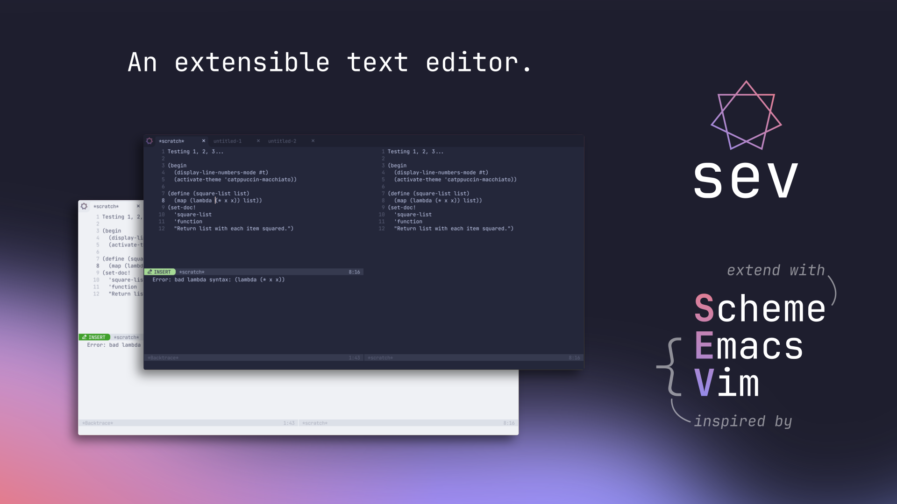

# Emacs From Scratch

This repo is my attempt at building an Emacs-like extensible text editor powered by:

- [SDL3](https://libsdl.org/) for windowing, rendering and low level device input.
- [Clay](https://www.nicbarker.com/clay) for UI.
- [Chibi Scheme](https://synthcode.com/wiki/chibi-scheme) as an embedded interpreted language, filling the same role as elisp in Emacs or Lua in Neovim.

It is _not_ an attempt to build a feature-complete clone of Emacs, but does aim to be:

- Genuinely usable.
- Lightweight / performant.
- Portable. More specifically, able to run on Windows, Mac, Linux _and_ in the browser via Emscripten and WebAssembly.
- Highly configurable and extensible via Scheme.

## Fresh build commands

```bash
# Desktop
cmake -S . -B build-desktop
cmake --build build-desktop

# WASM
emcmake cmake -S . -B build-wasm
cmake --build build-wasm

# WASM with optimisations
emcmake cmake -S . -B build-wasm -DCMAKE_BUILD_TYPE=Release
cmake --build build-wasm
```

## Rebuild commands

```bash
## Desktop
cd build-desktop
make -j$(nproc)

## WASM
cd build-wasm
make -j$(nproc)
```

## Running WASM build

```bash
python3 -m http.server
```
